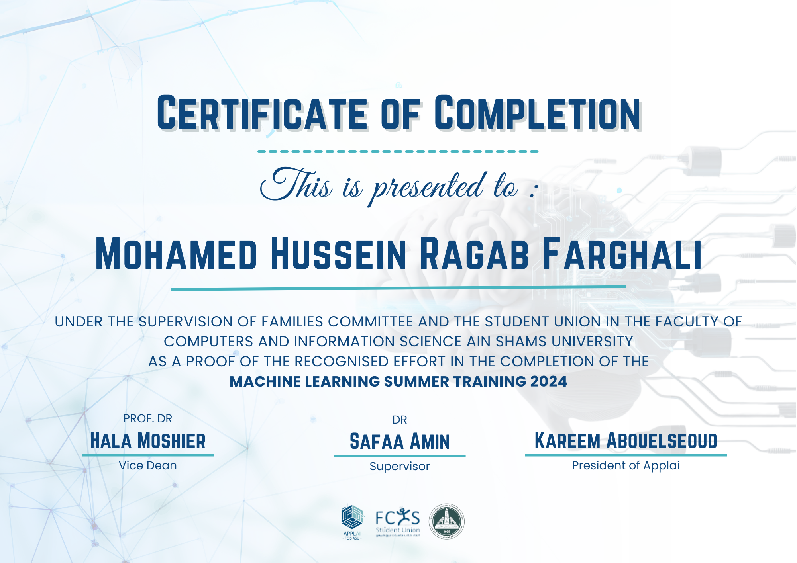

# Stroke Prediction Project - ApplAI ASU Summer Training

This repository contains the work completed during my **AI Summer Trainee** internship at **ApplAI ASU** (Sep 2024 – Oct 2024).

## Project Overview

The main objective of this project was to analyze patient records and build a machine learning model capable of predicting the likelihood of stroke based on various health factors. 

### Technical Details & Workflow:
- **Data Preprocessing**: Handled missing values, applied label encoding for categorical data, and utilized Z-Score Normalization for numerical features.
- **Outlier Handling**: Limited extreme outliers (values > 3 std dev) for `avg_glucose_level` and `bmi` using the cap-and-floor method.
- **Feature Selection**: Computed a correlation matrix and removed low-correlation variables to improve model performance.
- **Class Balancing**: Addressed target variable imbalance utilizing **SMOTE** oversampling.
- **Modeling**: Trained and evaluated SVM, KNN, Decision Tree, and Random Forest classifiers using `GridSearchCV` for hyperparameter tuning.
- **Evaluation**: Focused on maximizing recall using the **KNN model** to ensure high sensitivity for stroke detection, achieving an overall **85.7% accuracy**.

### Key Achievements:
- Built a Stroke Prediction ML pipeline (SVM, KNN, Random Forest) with **85.7% accuracy** using Python & Scikit-learn.
- Applied Z-score normalization, outlier capping, and **SMOTE** balancing on **5,000+ patient records**.
- Tuned models via **GridSearchCV** in a 4-member team, prioritizing recall for medical sensitivity.

## Contents
- `stroke-prediction-notebook.ipynb`: Jupyter notebook containing data preprocessing, exploratory data analysis (EDA), model training, and evaluation.
## Certificate of Completion

